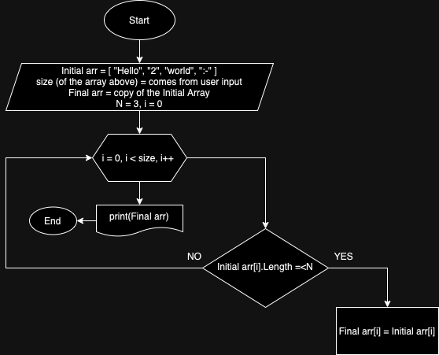

# Аннотация файла
## Условие задачи 
*Написать программу, которая из имеющегося массива строк формирует новый массив из строк, длина которых меньше, либо равна 3 символам. Первоначальный массив можно ввести с клавиатуры, либо задать на старте выполнения алгоритма. При решении не рекомендуется пользоваться коллекциями, лучше обойтись исключительно массивами.*

## Блок-схема

## Описание решения
В блок-схеме входными данными являются начальный массив *Initial Array* = *Initial arr*, который вводит пользователь с консоли (здесь же и определяется размер вводного массива). Здесь же мы вводим параметр типа *int N*, которое играет ключевую роль в последующем условии и *индекс i* для того, чтобы обращаться к элементам массива. *Final Array = Final arr* копируется с начального массива для того, чтобы мы могли запечатлеть результат. 

Определив входные данные, мы заходим в цикл *for*, где проходимся по каждому элементу массива и проверяем, соответствует ли каждый строчный элемент условию (длина строчного элемента должна быть меньше или равна N (в данном случае, 3)). Если элемент соответствует условию, записываем его в *Final arr*, если нет, то двигаемся дальше. 

Проверив все элементы, выводим получившийся массив на консоль. 

### Решение 1

В коде можно проследить, что в начале мы создали функцию, которая будет выполнять сортировку элементов по заданному условию и далее просто применили эту функцию для вывода результата на консоль. 

### Решение 2

Альтернативное решение включает в себя функцию, которая не возвращает значение, но мы сразу выводим на консоль получившийся массив. В данной функции сортировка происходит из оригинального массива в новый массив с помощью *inputArray.Where(s => s.Length <= 3).ToArray()*, где мы сразу записываем выбранные элементы в новый массив. Результат на консоли получается более оформленный. 

